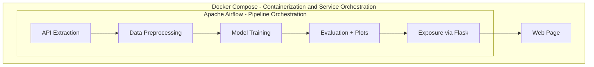
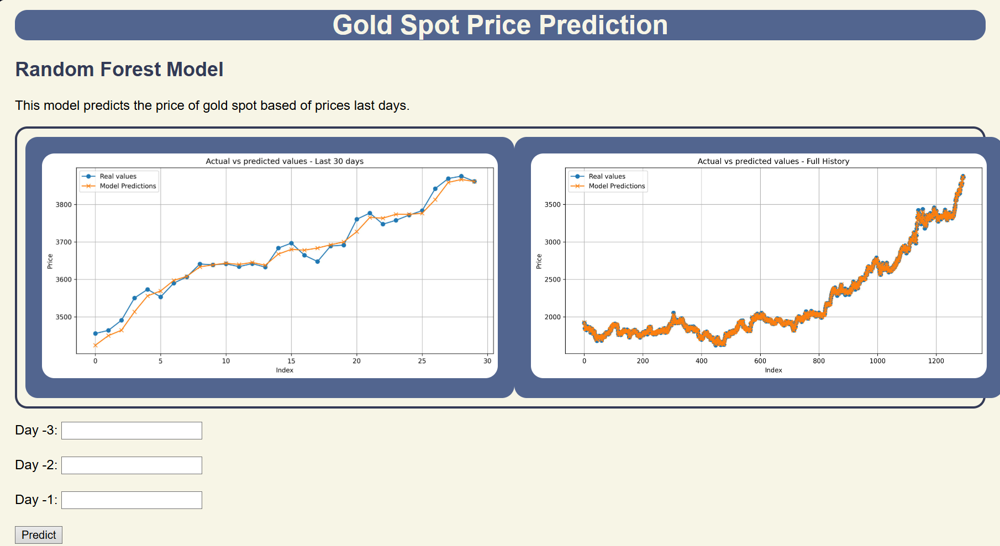

# Project ML - Random Forest API with Docker and Flask
This repository contains a pipeline project that goes from data extraction to exposing the model on a web page.

## 1. Description
This project implements an **end-to-end MLOps** pipeline, from data extraction through an API to exposing a model in a web interface.

Orchestration is handled by **Apache Airflow** and containerization with **Docker Compose**, ensuring portability and reproducible deployment. 

The focus is on demonstrating **best practices in MLOps** (orchestration, containerization, and deployment) to build a complete and automated end-to-end workflow.

---

## 2. Project Flow

1. Data extraction through an API
2. Data preprocessing
3. Training a machine learning model
4. Model evaluation and plot generation
5. Exposing the model through a Flask API and a web interface
6. Pipeline orchestration using Apache Airflow
7. Deployment and execution with Docker Compose

## 3. Technologies used
* Python 
* Flask (For the model API)
* Apache Airflow (For task orchestration)
* Docker & Docker Compose (For containerization and deployment)
* HTML/JS (For API consumption)

## 4. Project architecture


## 5. Project execution

1. Clone the repository
```bash
   git clone https://github.com/haroldcuellar24/mlops-end-to-end-pipeline-docker-airflow.git
```
2. Start the services with Docker Compose
```bash
   docker compose up --build
```
3. Access it at:
```bash
    Airflow: http://localhost:8080
    Web page: http://localhost:8000/index.html
```

## 5. Apache Airflow Webserver UI

In the Apache Airflow web interface, you can view and manage everything related to workflows (DAGs), e.g. status, task dependencies, timing, and logs

Preview

---


## 6. Frontend

The web page connects to the '/predict' endpoint of the API in Flask and displays the model’s predictions in an interactive form for the user. You can also try it with Postman.

Preview


## 7. Next steps
* Add validation and metrics for the Machine Learning model
* Implement data and model versioning